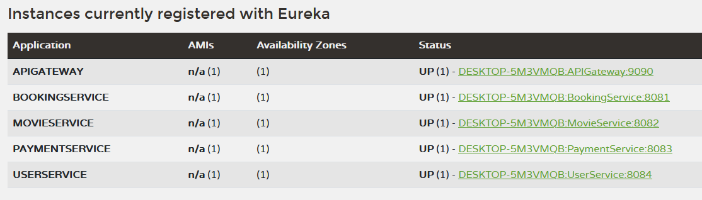

# MSA Project

## Topic:

Online movie ticket booking system

## Members: 

B115 Tanay Shah
B116 Adit Khandelwal
B119 Suhani Pugalia
B124 Athang Yawalkar

## Microservices:

### 1.User Microservices

Users have the following attributes:

1. Userid
2. Username
3. Email
4. Password
5. Role (user,admin,etc)
6. A timestamp showing time of creation of user

#### Crud operations implemented:

1. Creating new Users
2. Getting all Users
3. Getting user by ID 
4. Updating user details by ID
5. Deletion of user by ID

#### How to run locally?

1. Clone the entire repository and open in intellij ide
2. Make sure that Maven script has been detected or else add manually
3. Make a users_db in mysqlworkbench connection on port 3306
   (you can run the code: `CREATE DATABASE users_db;`)
4. The port is 8080 and the endpoint is api/users 

### 2. Booking Microservice

Bookings have the following attributes:

1. Booking ID
2. User ID
3. Showtime ID
4. Number of seats
5. Total amount
6. List of seat IDs (transient, not stored in DB)
7. List of Booking details (associated entity)

#### CRUD Operations Implemented:

1. Creating a new Booking
2. Getting all Bookings
3. Getting a Booking by ID
4. Deleting a Booking by ID

#### How to run locally?

1. Clone the entire repository and open it in IntelliJ IDEA.
2. Ensure that the Maven script is detected, or add it manually.
3. Create a `booking_db` in MySQL Workbench on port 3306.
   (You can run the command: `CREATE DATABASE booking_db;`)
4. The application runs on port **8082**, and the base endpoint is **api/bookings**.

### 3. Payment Microservice

Payments have the following attributes:

1. Payment ID
2. Booking ID
3. Payment method
4. Amount
5. Transaction ID (Auto-generated)
6. Payment status (PENDING, SUCCESS, FAILED)

#### CRUD Operations Implemented:

1. Creating a new Payment
2. Getting all Payments
3. Getting a Payment by ID
4. Getting a Payment by Transaction ID
5. Updating Payment status by ID
6. Deleting a Payment by ID

#### How to run locally?

1. Clone the entire repository and open it in IntelliJ IDEA.
2. Ensure that the Maven script is detected, or add it manually.
3. Create a `payment_db` in MySQL Workbench on port 3306.
   (You can run the command: `CREATE DATABASE payment_db;`)
4. The application runs on port **8083**, and the base endpoint is **api/payments**.

### 4. Movie Microservice

Entities in the Movie Microservice:

1. **Movie**
   - Movie ID
   - Title
   - Genre
   - Description
   - Duration
   - Release Date
   - Language

2. **Theater**
   - Theater ID
   - Name
   - Location
   - Total auditoriums
   - List of auditoriums (associated entity)

3. **Auditorium**
   - Auditorium ID
   - Name
   - Total seats
   - Theater ID (Foreign Key)

4. **Showtime**
   - Showtime ID
   - Movie ID (Foreign Key)
   - Show date
   - Show time
   - Price
   - Available seats

#### CRUD Operations Implemented:

1. **Movie**
   - Get all movies
   - Get movie by ID

2. **Theater**
   - Create a new Theater
   - Get all Theaters
   - Get Theater by ID
   - Update Theater by ID
   - Delete Theater by ID

3. **Auditorium**
   - Create a new Auditorium
   - Get all Auditoriums
   - Get Auditorium by ID
   - Update Auditorium by ID
   - Delete Auditorium by ID

#### How to run locally?

1. Clone the entire repository and open it in IntelliJ IDEA.
2. Ensure that the Maven script is detected, or add it manually.
3. Create a `movie_db` in MySQL Workbench on port 3306.
   (You can run the command: `CREATE DATABASE movie_db;`)
4. The application runs on port **8081**, and the base endpoint is **api/movies**.

### Eureka dashboard:

